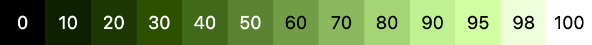
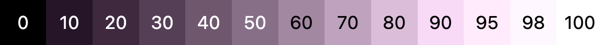

# Quick HCT

`Quick HCT` uses a precomputed tonal map to quickly approximate transformations of RGB colors to a given tonal value. Tone is one of the dimensions of the [HCT color space](https://m3.material.io/styles/color/the-color-system/key-colors-tones) introduced by [Material Design 3](https://m3.material.io). A tone value of 100 is equivalent to the idea of light at its maximum and results in white. Every tone value between 0 and 100 expresses the amount of light present in the color.

Example tonal range for RGB color #426915:



Example tonal range for RGB color #715573:



Usage:

```go
r, g, b := quickhct.WithTone(0x42, 0x69, 0x15, 40)
```

`Quick HCT` is released by `Microbus LLC` under the [Apache 2.0 license](http://www.apache.org/licenses/LICENSE-2.0).
